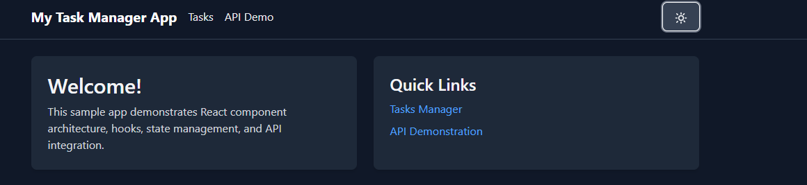
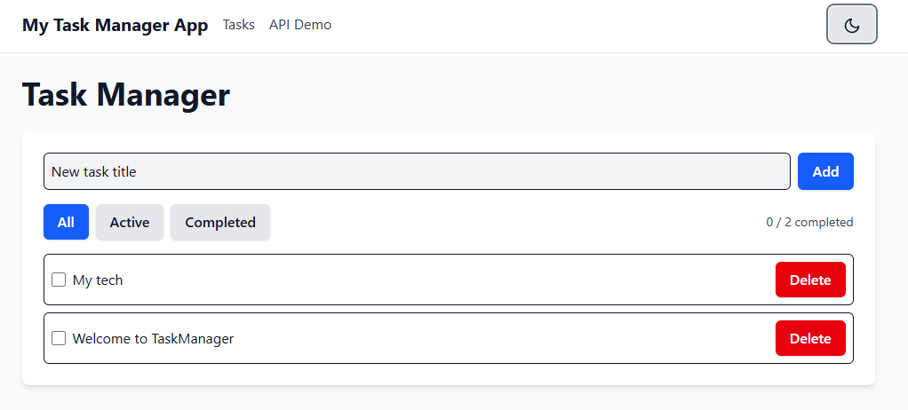
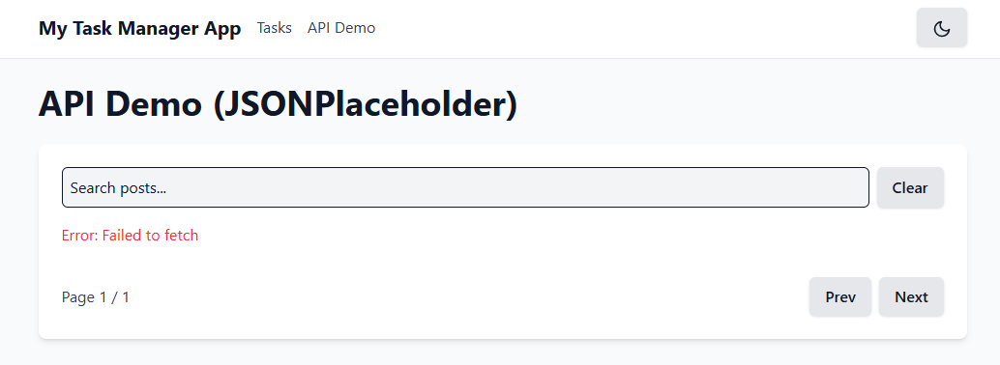
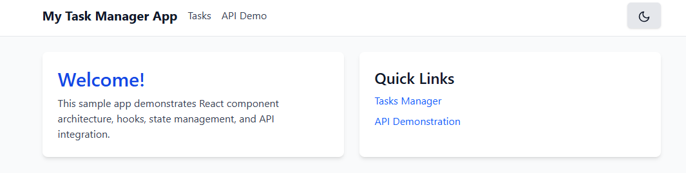
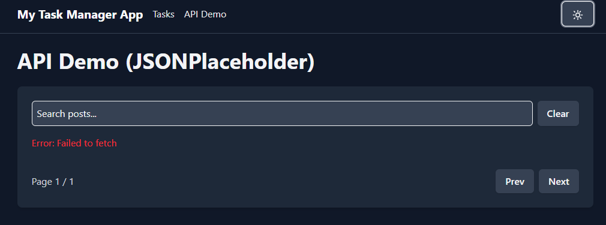

# My Task Manager App

A modern, responsive task management application built with React, featuring dark mode support, API integration, and local storage persistence.
You can access the app on this URL: https://my-task-manager-and-to-do-app.vercel.app/


## Features

### 1. Responsive Design
- Modern, clean interface that works on all devices
- Mobile-friendly navigation with hamburger menu
- Flexible layout that adapts to different screen sizes

### 2. Dark/Light Theme
Toggle between dark and light themes for comfortable viewing in any environment:




### 3. Task Management
- Add, complete, and delete tasks
- Tasks persist across page reloads using localStorage
- Clean, intuitive interface for task operations



### 4. API Integration Demo
- Demonstrates API integration with external data
- Paginated display of posts
- Loading states and error handling



### 5. Component Architecture
- Reusable UI components (Button, Card, Layout)
- Context-based theme management
- Custom hooks for data persistence

### 6. Screenshots Gallery
Here's a visual tour of the application's key features:

1. **Dark Mode Home Page**
   
   The application's home page in dark mode, showing the clean and modern interface.

2. **Theme Toggle Functionality**
   
   The theme toggle button in action, allowing users to switch between dark and light modes.

3. **Light Mode Interface**
   
   The application's interface in light mode, demonstrating the theme system's versatility.

4. **Task Management Interface**
   
   The task management interface where users can add, complete, and delete tasks.

5. **API Integration Demo**
   
   The API integration page showing fetched data with pagination.

6. **Mobile Responsive Design**
   
   The application's responsive design adapting to mobile devices.

## Tech Stack

- **React** - UI library
- **React Router** - Navigation and routing
- **Tailwind CSS** - Styling and dark mode
- **Vite** - Build tool and development server
- **localStorage** - Client-side data persistence

## Project Structure

```
my-assignment-app/
├── public/             # Static assets
├── src/
│   ├── components/     # Reusable UI components
│   │   ├── Button.jsx
│   │   ├── Card.jsx
│   │   ├── Footer.jsx
│   │   ├── Layout.jsx
│   │   └── Navbar.jsx
│   ├── context/       # React Context providers
│   │   └── ThemeContext.jsx
│   ├── hooks/         # Custom React hooks
│   │   └── useLocalStorage.js
│   ├── pages/         # Route components
│   │   ├── ApiPage.jsx
│   │   ├── Home.jsx
│   │   └── TasksPage.jsx
│   ├── widgets/       # Complex UI components
│   │   ├── ApiList.jsx
│   │   └── TaskManager.jsx
│   ├── App.css
│   ├── App.jsx       # Root component
│   ├── index.css     # Global styles
│   └── main.jsx      # Entry point
├── index.html
├── package.json
├── tailwind.config.js
└── vite.config.js
```

## Getting Started

### Prerequisites

- Node.js (v14 or higher)
- npm or yarn

### Installation

1. Clone the repository:
   ```bash
   git clone <repository-url>
   cd my-assignment-app
   ```

2. Install dependencies:
   ```bash
   npm install
   # or
   yarn
   ```

3. Start the development server:
   ```bash
   npm run dev
   # or
   yarn dev
   ```

4. Open [http://localhost:5173](http://localhost:5173) in your browser

## Available Scripts

- `npm run dev` - Start development server
- `npm run build` - Build for production
- `npm run preview` - Preview production build locally

## Development

### Code Style

The project uses ESLint and Prettier for code formatting. Editor settings are included in the project.

### Adding New Features

1. Components go in `src/components`
2. Pages go in `src/pages`
3. Complex widgets go in `src/widgets`
4. Hooks go in `src/hooks`
5. Context providers go in `src/context`

### Theme Customization

The app uses Tailwind CSS for styling with dark mode support:

- Light/dark mode is toggled using the 'dark' class
- Theme preferences are stored in localStorage
- Custom colors can be configured in `tailwind.config.js`

## Contributing

1. Fork the repository
2. Create your feature branch (`git checkout -b feature/AmazingFeature`)
3. Commit your changes (`git commit -m 'Add some AmazingFeature'`)
4. Push to the branch (`git push origin feature/AmazingFeature`)
5. Open a Pull Request
